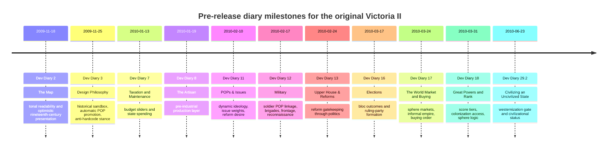

# Gameplay Systems and Design of

## Executive summary

The original 2010 release of entity["video_game","Victoria II","2010 grand strategy game"] is best understood as a tightly coupled political-economy simulator built around one core design wager: if population groups are modeled as materially differentiated actors with changing needs, then politics, industrialization, diplomacy, migration, and war can all emerge from the same social substrate rather than from isolated minigames. The official pre-release diaries repeatedly frame the game as a historical sandbox constrained by systems rather than hard-coded scripts, with the designers explicitly preferring “game mechanics that place historical constraints” over deterministic event chains. The result is a design where POP needs, income, literacy, ideology, reform desire, and access to goods become the load-bearing variables for nearly every other system. citeturn33view0turn31view0turn17search2turn17search7turn19search5

In design terms, the base game has three standout strengths. First, POPs make domestic politics legible as a downstream expression of economic conditions: ideology and issue support are dynamic, elections matter, and reforms function as pressure valves rather than purely top-down choices. Second, the economy is designed to motivate expansion without requiring constant conquest: spheres, rank, and market access turn diplomacy into a tool for building “informal empire.” Third, warfare is subordinated to politics and economics, but still structurally linked to them through soldier POPs, score, prestige, and market access. That combination is why the game still attracts design praise from players who value “political-economic-societal mechanisms” more than later genre alternatives. citeturn31view0turn30view0turn15view1turn41search7turn16search13

Its main weaknesses are equally structural. The most prominent community criticism is not that the systems are disconnected, but that their connections produce brittle endgame behavior. The strongest Reddit analyses argue that late-game economic collapse is driven by demand growth outpacing wage and price flexibility, with POP needs scaling up through plurality, consciousness, and inventions while purchasing power remains too static; many of the key economic behaviors are also described by players as hardcoded, limiting what mods can repair. Other recurring pain points are migration outcomes perceived as ahistorical, opaque common-market and sphere behavior, and reform politics that can feel more gamey than historically persuasive. citeturn9view0turn38search18turn39search28turn41search11turn16search13

For a game-design audience, the central conclusion is this: vanilla entity["video_game","Victoria II","2010 grand strategy game"] is not primarily a war game or an “economy game” in isolation. It is a cascading dependency model in which social simulation drives economic demand, economic access shapes political satisfaction, political pressure changes reform capacity, and diplomatic rank alters material access. That architecture is still unusually coherent. The same architecture also explains why, when one part bends unrealistically, the rest of the simulation amplifies the distortion rather than containing it. citeturn33view0turn31view0turn17search2turn19search5turn41search4

## Diary map and source frame

This report prioritizes three source families: official pre-release diaries published on urlParadox Forumshttps://forum.paradoxplaza.com, the current urlVictoria 2 Wikihttps://vic2.paradoxwikis.com, and historical discussion threads from urlReddithttps://www.reddit.com/r/victoria2/. The official base-game diary list on the wiki shows 29 numbered diaries plus bonus posts spanning from 2009-11-18 to 2010-06-23. The same wiki page surfaces exact dates for key mid-cycle posts such as “Pops & Issues” on 2010-02-10, “Military” on 2010-02-17, “Upper House & Reforms” on 2010-02-24, “Elections” on 2010-03-17, and “The World Market and Buying” on 2010-03-24. citeturn48search0turn45search13turn46search0turn26search0

Because the current crawl could not directly retrieve every official forum thread, some diary quotations are taken from mirrored reposts or academic excerpts that preserve the official thread title, quotation, and original official URL. I have treated those as partial recoveries of primary material, not as substitutes for the official corpus. Where the current wiki appears to reflect later patch or expansion-era understanding, I flag version ambiguity rather than silently treating it as uncontested vanilla-2010 fact. This matters because the later expansions clearly added systems such as foreign investment, crises, and new colonization and naval rules that are outside the scope of the original release. citeturn31view0turn30view0turn33view0turn34view1turn11search0turn11search1

The high-confidence timeline for the diaries most relevant to vanilla system design is below. Some intermediate entries are omitted because their exact posting dates were not surfaced in the current retrieval, but their position in the sequence is clear from the official diary list. citeturn48search0turn47search0turn45search13turn46search0turn26search0

The design connections implied by the diaries and the wiki can be summarized as one interlocking loop rather than separate feature silos. citeturn33view0turn31view0turn17search2turn18search1turn19search5turn41search4

```mermaid
flowchart LR
    A[POP literacy, class, culture, religion, job] --> B[Promotion and demotion]
    A --> C[Needs and demand]
    C --> D[Income sufficiency]
    D --> E[Militancy and consciousness]
    E --> F[Issues, ideology, reform desire]
    F --> G[Elections and Upper House]
    G --> H[Political and social reforms]
    H --> I[Immigration attraction and social stability]
    B --> J[Research points and industrial labor pool]
    J --> K[Technology and inventions]
    K --> C
    K --> L[Factory throughput, RGO output, army effectiveness]
    L --> M[Industrial, military, and prestige score]
    M --> N[Rank, Great Power status, influence]
    N --> O[Spheres and market access]
    O --> D
    O --> L
    P[War and diplomacy] --> M
    P --> O
    P --> E
```

## POPs and issues

**Concise summary.** “POPs & Issues,” “Upper House & Reforms,” “Elections,” and the wiki’s population, POP-attitude, ideology, political-reform, and social-reform pages all point to the same core abstraction: the player does not directly command society. Instead, society is modeled as weighted opinion moving over time, and state action is filtered through those moving weights. POPs do not just consume and work; they vote, agitate, reform, rebel, migrate, and promote. That makes them the game’s master system. citeturn31view0turn35search4turn17search2turn17search7turn19search21turn19search10turn17search22

**Design goals and developer intent.** The diaries were explicit that vanilla’s politics were meant to be more responsive and less deterministic than the first game. The POP issue system moved from reset-based values to calculated weights that change gradually; the stated goal was for later politics to be more historical without hard-coding every country into the same ideological trajectory. The diaries also emphasize “bottom up pressure”: reform demand should come from POPs themselves, with election events nudging rather than dictating results. In design language, that is a move from event-driven politics to pressure-driven politics. citeturn31view0turn35search2turn35search4turn33view0

**Mechanics and formulas.** The official wiki’s population page gives the clearest retrieved formula for POP goods demand:  
`Needs = (1 + Plurality) * (1 + 2 * CON / PDEF_BASE_CON) * (1 + inventions * INVENTION_IMPACT_ON_DEMAND) * base * BASE_GOODS_DEMAND * pop size / 200000`. The same page also notes the base demand interpretation as one unit per day per 200,000 people, scaled by `BASE_GOODS_DEMAND`, and the Reddit economic analysis reproduces the same formula while stressing that plurality, consciousness, and inventions all ratchet demand upward over time. The wiki’s POP-attitudes page states that plurality raises consciousness, and in democracies higher consciousness makes voting align more closely with POP preferences. On reforms, the ideology page states that each point of militancy, or each 10% of reform-movement strength, makes 10% of conservatives in the Upper House willing to back reforms. The social-reform page adds that reactionaries may repeal reforms, conservatives and reactionaries usually resist them, and the Upper House becomes more conservative immediately after passing a social reform. Promotion and demotion are also systemic rather than manual: the promotion page summarizes higher literacy as increasing promotion and decreasing demotion, fulfillment of life needs as increasing promotion, and high militancy as reducing promotion. citeturn17search2turn39search21turn9view0turn17search7turn40search0turn19search21turn45search5turn17search22turn27search1turn17search27turn39search17

**Community interpretations and criticisms.** Reddit’s long-running interpretation is that consciousness is neither simply “good” nor “bad”; it is a modernization accelerant that also destabilizes conservative control. Players repeatedly describe high consciousness as increasing reform desire, reducing passive conservatism, and indirectly driving militancy when POP expectations are not met. Community guides also separate low-militancy socialists from high-militancy communists, and treat anarcho-liberals and fascists as outputs of specific mixes of deprivation, reform blockage, revanchism, and ideology. The common criticism is that the reform game can become too manipulative: experienced players learn to engineer militancy or suppress movements to move the Upper House, which is coherent as a system but can feel like working the simulation rather than governing a society. citeturn40search2turn40search13turn40search9turn43view1turn40search10turn40search6

**Interactions with other systems.** This POP model is where politics, economy, and technology meet. Needs depend on plurality, consciousness, inventions, and POP size; unmet needs influence militancy; militancy reshapes reform coalitions; reforms alter immigration attraction and stability; literacy drives both promotion and research. In design terms, the game’s domestic simulation is built as feedback loops rather than as one-way trees. That is why the same literacy policy can simultaneously boost research, raise consciousness, expand demand, and alter long-run party composition. citeturn17search2turn17search7turn18search1turn38search1turn39search0

**Known bugs, quirks, and modding notes.** Several politics UI and reform-consistency issues were later patched in vanilla. Patch notes mention fixes for disappearing pop needs in the details screen, inconsistent reform-support tooltips, scaled militancy support for social reforms, and increased militancy reduction behavior. For modding, the official wiki documents event and decision scripting through `List of conditions`, `List of effects`, and `Modifier effects`; these pages expose direct levers for consciousness, militancy, upper-house ideology share, and modifiers, but not every deeper behavioral rule. citeturn17search32turn40search16turn45search11turn17search0turn17search1turn17search6turn45search7

| Source lens | Diary emphasis | Wiki emphasis | Reddit emphasis |
|---|---|---|---|
| Political agency | Player steers outcomes, but only indirectly; systems should apply “historical constraints” rather than scripts. citeturn33view0 | POP attitudes, reform rules, and promotion factors are formulaic and persistent rather than event-reset. citeturn17search7turn17search27turn19search21 | Skilled players treat consciousness and militancy as tunable levers, sometimes to a degree that feels gamey. citeturn43view1turn40search10 |
| Elections | Elections should matter more because issue shifts persist and events can “nudge” outcomes. citeturn31view0turn35search2 | Bloc voting and reform pathways are governed by Upper House composition and government type. citeturn27search2turn19search10 | Community advice focuses on manipulating voter blocs through reforms, deprivation, or party control. citeturn43view1turn40search6 |
| Reform logic | POPs generate “bottom up pressure” for reforms. citeturn31view0 | Militancy mathematically pushes conservatives toward reform support; social reform passage also pushes the house back toward conservatism. citeturn45search5turn27search1 | Players see reform timing as the decisive anti-revolt tool, but also complain about Upper House opacity. citeturn16search12turn40search6 |

## Economy, production, trade, loans, and debt

**Concise summary.** The economy is the game’s other master abstraction, but it is not independent of POP simulation. The diaries frame the design problem bluntly: the game must maintain a “working economy” because the player taxes POPs, POPs need money, and the simulation stops being fun if the economic core does not circulate. Vanilla therefore builds one big chain: RGOs and factories produce goods, POPs consume according to class-weighted needs, budgets tax or tariff the flows, banks intermediate savings and loans, and trade rank plus sphere status determines who gets access to what. citeturn34view1turn17search3turn19search3turn17search8turn19search5

**Design goals and developer intent.** The official diaries reveal two intentions that matter a great deal for design analysis. First, the economy was deliberately pushed toward what the designer called “economic conservatism,” meaning a model that privileges circulation and legibility over ideological purity. Second, “The World Market and Buying” makes clear that diplomacy and force are meant to secure privileged trade access without requiring direct annexation: the diary explicitly describes sphere-building as a way to create “informal empire” through captive markets. This is not a side mechanic. It is the design bridge between economics and imperialism. citeturn34view1turn15view1

**Mechanics and formulas.** The official wiki’s production page states that throughput bonuses let a factory take in more inputs and produce more outputs at the same efficiency rate, and that all produced goods enter the world market for POP consumption or factory input. The industrialization guide highlights how strong commerce technology can be by around mid-century, summarizing large cumulative RGO and throughput gains plus smaller input/output shifts, although exact applicability to the launch build is partly version-ambiguous. The RGO page adds a concrete income rule: owner income is capped at 50% of RGO income, with the remainder going to paid workers. The trade page states that trade is AI-managed and that goods unsold on the internal or sphere market flow onward; it also describes the sphere/common-market ordering logic in which great powers and their spherelings trade with preferential access before full world-market exposure. For banking, the loans page states that POPs save excess income in the national bank and governments borrow from their own national bank first before going abroad. Budget-wise, tariffs are taxes on imported goods bought by POPs and factories. citeturn17search3turn38search19turn38search13turn38search3turn17search15turn18search0turn38search21turn19search5turn17search8turn36search2turn19search3

**Community interpretations and criticisms.** The single most substantial Reddit critique of vanilla is its late-game economic failure mode. The strongest analysis argues that the issue is not primarily a “liquidity crisis,” but static purchasing power in the face of steadily rising POP needs: plurality, consciousness, and inventions all increase needs, while state-paid POP wages and many worker-income structures do not rise comparably, and prices do not flex downward enough to restore purchasing power. Other community threads continue to debate whether money pooling, disappearing interest payments, or debt loops are the bigger culprit, but there is broad agreement on two points: the economy becomes increasingly opaque over time, and many of the most consequential fixes are outside the reach of normal modding because core behaviors are hardcoded. Community industrial guides therefore focus on literacy, RGO techs, throughput, market access, and state support for profitable industrial chains rather than on elegant equilibrium. citeturn9view0turn38search14turn43view2turn42view1turn42view0turn38search12

**Interactions with other systems.** The economic model depends on politics and rank at every step. POP need satisfaction influences militancy, promotion, and migration; literacy improves both research and industrialization; technology changes RGO output, factory throughput, and input efficiency; Great Power status and spheres reshape access to raw materials and buyers; war can be used to secure strategic materials or to reconfigure trade geography. This is why community players treat spheres and market access as economic instruments, not just diplomatic trophies. citeturn17search2turn18search1turn38search4turn42view3turn43view3

**Known bugs, quirks, and modding notes.** Vanilla patch notes and community analysis together point to several recurring quirks: unstable or misleading economic UI, RGO oscillation bugs later fixed in patch 1.4, and economy-shaping constants such as gold cash rates residing in defines while major price behaviors remain effectively hardcoded. The official modding pages expose `factory_throughput`, `immigrant_attract`, many event effects, and folder/file structures, but Reddit analysis repeatedly emphasizes that crucial price and transaction behaviors are not realistically fixable through script alone. citeturn19search20turn17search1turn17search10turn17search17turn9view0

| Source lens | Diary emphasis | Wiki emphasis | Reddit emphasis |
|---|---|---|---|
| Core economic objective | Keep POPs solvent enough to tax and to sustain fun; preserve a “working economy.” citeturn34view1 | Trade, production, tariffs, and loans are linked through market flow and national-bank rules. citeturn17search3turn19search3turn36search2 | Endgame collapse is the defining vanilla failure mode. citeturn9view0turn38search18 |
| Production model | Post-entity["video_game","Victoria: An Empire Under the Sun","2003 grand strategy game"] production and unemployment were redesigned to reduce older micromanagement burdens. citeturn34view3 | Throughput, RGO ownership caps, and AI-managed trade are the main formal levers surfaced by the wiki. citeturn17search3turn18search0turn38search21 | Industrial success depends heavily on literacy, throughput, resource access, and demand circulation. citeturn42view1turn38search4 |
| Trade and empire | Sphere access is meant to create “informal empire” through privileged buying and selling. citeturn15view1 | Sphere/common-market ordering and Great Power rank shape access to goods. citeturn19search5turn41search4 | Players treat spheres as indispensable for inputs, strategic goods, and tariff-free market depth. citeturn42view3turn43view3 |
| Debt and banking | Exact launch-build debt formula was not surfaced in the retrieved diaries; unspecified. | Governments borrow from their own national bank first; savings originate in excess POP income. citeturn17search8turn36search2 | Bankruptcy thresholds, debt loops, and disappearing interest are widely discussed but still partly contested. citeturn43view2turn36search22 |

## Diplomacy, great powers and rank, and military

**Concise summary.** In vanilla, diplomacy and warfare are not the center of play, but they are the game’s principal externalizers of domestic and economic power. The diaries repeatedly say so. Diplomacy inherits familiar relation values and war-goal logic, but Great Power rank, influence, spheres, and military modernization turn external play into a contest over market access and status rather than just over map painting. The military system is then designed to express nineteenth-century transition: smaller tactical units tied to population, reconnaissance early through cavalry and later through aircraft, and an evolving frontage model that tries to move from maneuver war toward entrenched late-period conflict. citeturn15view0turn15view1turn30view0turn41search4

**Design goals and developer intent.** The diplomacy diary describes relation values from -200 to +200, but its more important point is AI responsiveness: diplomatic and in-game actions should shift how states evaluate one another. “The World Market and Buying” goes further by making war and diplomacy alternative means to acquire commercial advantage. “Great Powers and Rank” then formalizes a hierarchy of four country classes and explicitly ties colonization access to top-tier ranking. The military diary is equally candid that war is not the primary focus, yet still needs a serious redesign: the stated aim is a “blend of flexibility vs. micromanagement,” linking units to soldier POPs and using military systems to show the evolution of warfare rather than merely to reproduce generic grand-strategy combat. citeturn15view0turn15view1turn33view0turn30view0

**Mechanics and formulas.** From the official wiki, Great Powers are the top eight states by total score, with ranks nine through sixteen becoming secondary powers; total score is defined as prestige plus industrial score plus military score, and uncivilized countries remain below civilized ones regardless of raw score until they westernize. Influence is unique to Great Powers. The military wiki surfaces the launch-relevant stat categories: attack and defense apply depending on side, reconnaissance speeds occupation and has battlefield value, and later army-doctrine technologies raise dig-in cap and fort levels while increasing supply consumption. The military diary adds several design specifics not surfaced numerically elsewhere in the crawl: brigades are 3,000-man units tied to soldier POPs in specific provinces, artillery occupies the rear rank, reconnaissance loses value over successive combat rounds, and late-period scouting shifts from cavalry toward aircraft. Exact frontage math and influence-generation formulas were not fully surfaced in the retrieved sources and should be treated as unspecified here. citeturn41search4turn41search2turn41search0turn41search16turn19search0turn19search8turn30view0

**Community interpretations and criticisms.** Reddit tends to praise vanilla’s military model more than its economy, especially its relation between line units, support units, recon, and technological timing. Community guides converge on artillery-heavy armies with a recon element, and on the idea that supply, reinforcement, and tech timing matter more than raw stack size. Diplomatic discussion is more utilitarian: sphere systems are valued because they guarantee access to key goods, make minors diplomatically pliable, and support formations like Germany or Italy. Criticisms cluster around opacity rather than concept. Players often understand that spheres matter, but not precisely how influence math, common markets, or resource priority work. citeturn16search6turn42view2turn41search1turn42view3turn41search11

**Interactions with other systems.** Rank and war are economically instrumental. Military and industrial development raise score; score raises rank; rank unlocks influence; influence produces spheres; spheres expand market access; market access stabilizes industrialization and military supply. The same logic applies in the other direction: diplomacy can prevent rival expansion, protect trade corridors, or secure common-market input pools that let POPs leave RGOs for factories. The design consequence is that vanilla’s military layer is strategically subordinate but systemically indispensable. citeturn41search4turn41search0turn43view3turn42view0

**Known bugs, quirks, and modding notes.** Vanilla patch notes mention fixes to influence edge cases, such as influencing countries while under truce, and general military-stat or UI corrections over time. The official `Defines.lua` page also shows that some macro-structure, like the number of Great Powers, is configurable, while combat and diplomatic internals are only partly script-visible. That distinction matters for modding: configuration is exposed, but core logic is not always transparent. citeturn19search17turn41search20turn17search20

| Source lens | Diary emphasis | Wiki emphasis | Reddit emphasis |
|---|---|---|---|
| Diplomacy | Relations should feed AI behavior; war and diplomacy are alternate routes to commercial advantage. citeturn15view0turn15view1 | Great Power status, influence, total score, and sphere effects are the formal core. citeturn41search0turn41search2turn41search4 | Spheres are prized mostly for goods access, pliability of minors, and formable-tag support. citeturn42view3turn41search15 |
| Rank hierarchy | “Four classes of country” define status and colonization access. citeturn33view0 | Top eight are Great Powers; 9–16 are secondary powers. citeturn41search2 | Players optimize for staying in GP ranks because spheres are materially decisive. citeturn41search11turn41search23 |
| Military theory | Warfare should show nineteenth-century evolution while keeping micromanagement manageable. citeturn30view0 | Recon, attack, defense, dig-in, and fort progression are the clearest surfaced variables. citeturn19search0turn19search8 | Army guides reduce the system to support-heavy compositions, recon timing, and supply awareness. citeturn16search6turn42view2 |

## Research, technology, migration, and westernization

**Concise summary.** Technology in vanilla is not a standalone progress tree. It is a multiplier system that alters POP behavior, industrial performance, military capability, and civilizational status. Migration then acts as a geographic response to those incentives, while westernization/civilization is the game’s most overtly gated macro-status transition. These systems are therefore best read together: literacy and research capacity change domestic composition; reforms and prosperity change attractiveness; westernization changes what a state is allowed to do at all. citeturn18search1turn38search1turn39search0turn44search6turn44search10

**Design goals and developer intent.** “Design Philosophy” explicitly uses automatic POP promotion and low literacy as a way to model relative backwardness without hard scripting outcomes. “Civilizing an Uncivilized State” then makes that same idea macro-political: countries can move categories, but only after meeting systemic conditions. The design ambition is elegant in one sense, because it ties international status to domestic modernization rules. It is also the point where the diaries most clearly reveal their period ideology: the diary language of being considered “civilised” by “the world” builds a eurocentric ladder directly into the rules. citeturn33view0turn44search2

**Mechanics and formulas.** The wiki’s research pages break research points into literacy, clergy, clerk, and national-modifier components, surfacing retrieved weights of 4 from literacy, 1.5 from clergymen, and 0.5 from clerks, with a broader formula summarized as the sum of literacy, clergy, clerk, and national bonus components times modifiers; the exact full expression was not completely surfaced in the current crawl. Technology pages also show its broad effect structure: army doctrine raises dig-in cap and forts, commerce technology improves RGO output and diplomatic influence and later triggers factory-helping inventions, and inventions unlock many second-order economic or political effects. Migration is formulaic as well: the migration page states that actual migration percentage is calculated by adding active factors together and multiplying by a base migration rate. The official pages and Reddit discussions point to reforms, democracy/republican government, jobs, low unemployment, and continental modifiers as major immigration drivers; the wiki also notes continent-based attraction bonuses for places like South America and Oceania. For westernization, the wiki states that uncivilized nations cannot build factories by normal means, cannot become secondary or great powers, and remain beneath civilized states until westernized. Exact weighted values for most migration modifiers and westernization costs were not fully surfaced here, so those remain partly unspecified. citeturn18search1turn38search1turn38search2turn38search3turn38search15turn17search4turn39search5turn39search1turn39search11turn39search22turn44search6turn44search10

**Community interpretations and criticisms.** Reddit advice around research is practical and consistent: boost literacy early, prioritize research-point and education technologies, and align industrialization with clergy/clerk promotion. Migration debate is more critical. Players regularly complain that immigration is too concentrated in a few favored targets, especially the United States and some New World republics, and that monarchy-versus-republic incentives can feel more mechanical than historical. Community threads also note that the immigration national focus changes provincial share more than total inflow, which is a subtle but important design distinction: the player can redirect migration internally more reliably than they can conjure it from the global pool. citeturn38search0turn38search4turn39search28turn39search30turn43view0

**Interactions with other systems.** Literacy raises research points and promotion; promotion shapes industrial labor and administrative capacity; technology raises throughput, RGO output, army effectiveness, and inventions; inventions raise POP demand; social and political reforms then influence immigration; immigration changes where labor and future research potential accumulate. Westernization cuts across all of it by determining whether the state can participate on equal formal terms in the first place. citeturn18search1turn17search27turn38search3turn17search2turn39search0turn44search10

**Known bugs, quirks, and modding notes.** Migration and reform support saw multiple vanilla patch adjustments, including fixes that prevented low-population areas from fully depopulating and prevented emigration to occupied provinces. On the modding side, official pages expose `immigrant_attract`, assimilation-rate modifiers, culture modding, national focus modding, and folder/file structure. That makes migration and culture tuning relatively more moddable than pricing behavior, even though the full migration decision stack remains opaque. citeturn39search12turn39search7turn39search14turn17search26turn17search17turn17search30

| Source lens | Diary emphasis | Wiki emphasis | Reddit emphasis |
|---|---|---|---|
| Research design | Literacy and automatic POP promotion are tools for modeling uneven modernization. citeturn33view0 | Research points are decomposed into literacy, clergy, clerks, and modifiers. citeturn18search1turn38search1 | Early literacy and RP techs are treated as near-universal priorities. citeturn38search0turn38search4 |
| Migration | Exact migration-focused diary exposition was not surfaced; unspecified. | Migration is factor-based and multiplied by a base rate; reforms and geography matter. citeturn17search4turn39search5 | Immigration is widely seen as overly concentrated and partly ahistorical. citeturn39search28turn39search30 |
| Westernization | Civilizational status is a systemic threshold, not just a flavor label. citeturn44search2 | Uncivilized states are mechanically restricted until westernized. citeturn44search6turn44search10 | Players view fast civilization as one of the biggest skill differentiators for non-European starts. citeturn44search3 |

## Bugs, quirks, modding, and limitations

The most important vanilla quirk is that its most brilliant feature and its most fragile feature are the same thing: tightly coupled systemic design. The official diaries set out to remove hardcoded historical steering where possible and replace it with interacting social and economic constraints. That ambition succeeds. It also means errors propagate. If POP demand increases too fast, or if prices and wages cannot clear properly, late-game factories stop making money, POPs stop satisfying needs, budgets destabilize, reform pressure becomes noisier, and player perception shifts from “deep simulation” to “opaque breakdown.” The Reddit literature is unusually consistent on that point, even where it disagrees on precise causal language. citeturn33view0turn9view0turn38search14

From a modding perspective, the official wiki documents a meaningful but incomplete toolbox: modifier syntax, effects, conditions, event/decision structure, folder overview, culture editing, national focus editing, and defines all exist and are scriptable to some degree. Modders can alter throughput, immigration attraction, consciousness and militancy events, culture behavior, and many state modifiers. They cannot easily rewrite every core market rule, price behavior, or hidden transaction order. The community’s repeated claim that important parts of the economy are hardcoded is therefore plausible within the limits of the retrieved corpus and helps explain why even sophisticated mods tend to rebalance incentives around the edges more than they fully replace the vanilla economic engine. citeturn17search0turn17search1turn17search6turn17search10turn17search17turn41search20turn9view0

The other major limitation is source versioning. The current wiki is invaluable, but not every page is cleanly separated by patch or expansion state. I excluded clearly expansion-specific systems such as foreign investment, crises, and the later colonization and naval reworks, but some quantitative wiki guidance may still reflect post-release vanilla patches rather than only the launch executable. Where the retrieved sources were clear, I presented mechanics as high confidence. Where exact formulas or launch-build-only values were not cleanly surfaced, I have marked them unspecified or version-ambiguous rather than pretending to certainty. citeturn11search0turn11search1turn26search0turn17search5turn41search14

**Open questions and limitations.** Exact launch-build formulas for combat frontage, influence generation, debt-limit calculation, and the full weighted migration stack were not fully surfaced in the retrieved sources. Some direct official diary pages were unavailable to the crawler, so several diary quotations come from mirrored reposts or academic excerpts that preserve the official thread URLs. Finally, at least one economically important topic — how sphere/common-market purchase priority really works under the hood — remains contested between older common explanations and later reverse-engineering on the wiki and in community analysis, so it should be treated cautiously in strictly launch-version design reconstruction. citeturn30view0turn36search10turn17search4turn31view0turn33view0turn41search14